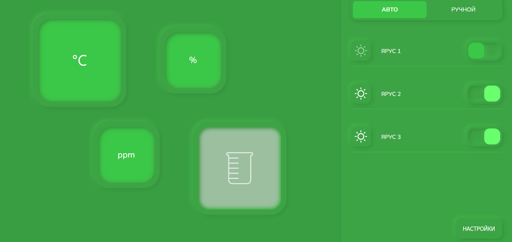

# Графический интерфейс для управления сити фермой

---
## Установка Node.js

Сначала вам нужно установить Node.js, если у вас его еще нет на компьютере. Node.js позволяет выполнять JavaScript на сервере и включает в себя пакетный менеджер npm (Node Package Manager). Для установки Node.js, выполните следующие шаги:

- Перейдите на [официальный сайт Node.js](https://nodejs.org/).
- Скачайте установщик Node.js для вашей операционной системы (Windows, macOS, Linux).
- Запустите установщик и следуйте инструкциям по установке.

## Команда `npm install`

После успешной установки Node.js вы готовы выполнять команды с помощью npm. Для установки зависимостей в корневой папке вашего проекта выполните следующие шаги:

1. Откройте командную строку (терминал) на вашем компьютере.
2. Перейдите в папку city и выполните команду `npm install`. Эта команда установит все зависимости, указанные в файле `package.json` вашего проекта.

## Команда `npm run serve`

После успешной установки зависимостей, вы можете запустить ваш проект с помощью команды `npm run serve`. Эта команда, вероятно, указана в вашем файле `package.json` в разделе "scripts". Выполните следующие шаги:

1. В командной строке, находясь в корневой папке проекта, выполните команду `npm run serve`.
2. Это запустит ваше приложение (или проект) в режиме разработки, и вы увидите вывод, который покажет вам адрес, по которому ваше приложение доступно в браузере (например, `http://localhost:3000`).

---

